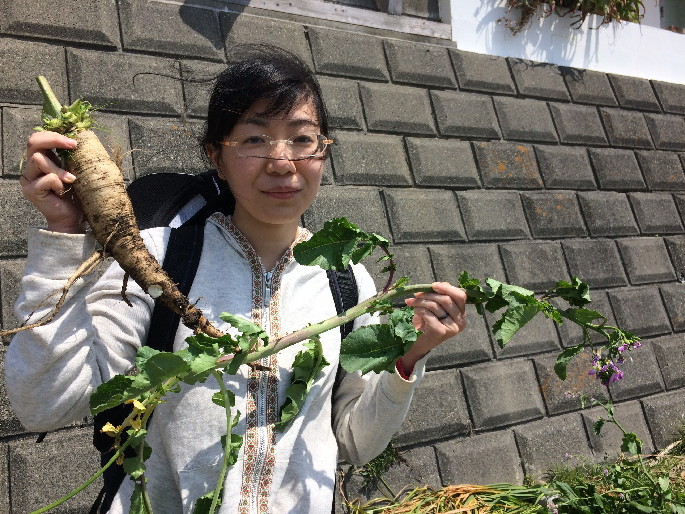

## 坂本 莉沙 (さかもと りさ)

## 現所属
日本学術振興会特別研究員(DC1)
東京大学大学院 農学生命科学研究科 生産・環境生物学専攻 生物測定学研究室
指導教員： 岩田 洋佳 准教授
### 所属学会
日本育種学会 

## 略歴
平成23 (2011)年　4月 - 平成27 (2015)年　3月　お茶の水女子大学大学　理学部　生物学科
平成27 (2015)年　4月 - 平成29 (2017)年　3月 東京大学大学院 農学生命科学研究科　生産・環境生物学専攻 修士課程
平成27 (2017)年　4月 - 現在 東京大学大学院 農学生命科学研究科　生産・環境生物学専攻 博士課程
平成27 (2017)年　4月 - 現在 日本学術振興会特別研究員(DC1)

## 受賞歴
「生物チャレンジ2009」 金メダル, 広島大学特別賞（実験試験1 位）
「国際生物学オリンピック韓国大会」 銀メダル
「京都大学VBL グローバルリーダー育成カップ」 三井物産賞
「第11 回MIT-EFJ ビジネスプランコンテスト&クリニック」 正会員特別賞

## 取得資格

## 過去の栄光
### 生物学オリンピック関連事項
高校１年生の時に「生物チャレンジ2008」に参加. 全国の生物学好きの高校生と親睦を深めた.
高校２年生の時に「生物チャレンジ2009」に参加. 高校３年生も参加する中で総合成績10 位以内の金メダル, 実験試験１位として広島大学特別賞を獲得. 更に, 選考を経て国際生物学オリンピック韓国大会の代表選手4 人のうちの一人に選ばれる. 代表選手として基礎生物学研究所,お茶の水女子大学などの一流の研究機関で特別教育をうけた.
高校３年生の時に国際生物学オリンピック韓国大会に出場し, 銀メダルを獲得.
### ビジネスコンテスト関連事項
「全国学生環境ビジネスコンテストem factory2011」に参加. 株式会社日清製粉グループに対しビジネスプランを提案.
「京都大学VBL グローバルリーダー育成カップ」に参加. 三井物産賞を獲得.
「第11 回MIT-EFJ ビジネスプランコンテスト＆クリニック」に参加. 正会員特別賞を受賞.
### その他重要な事項
全国の臨海・臨湖実験所の公開実習に参加. 全国10 カ所のフィールドで学んだ.
大学３年生の時に大学の学園祭でサークルのメンバーとともに自ら採集した生物の標本を展示し一般向けに解説を行った.
大学４年間で128 単位取得. GPA は3. 07 の優秀な成績を収めた.

